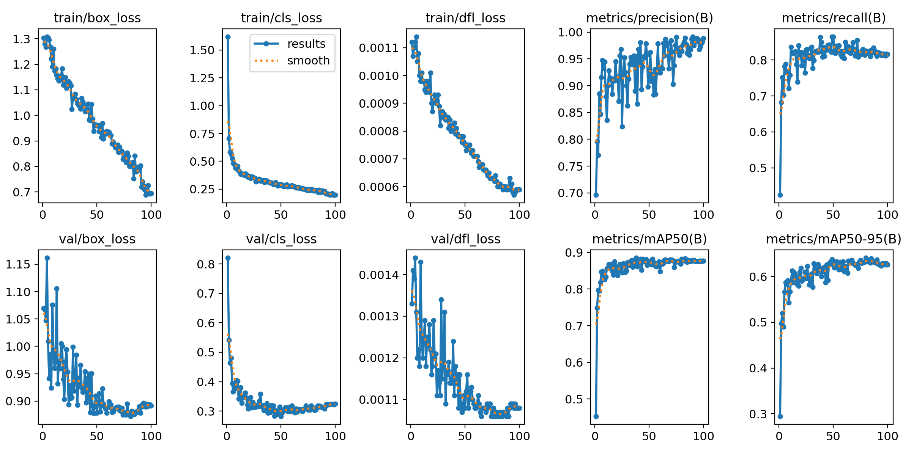
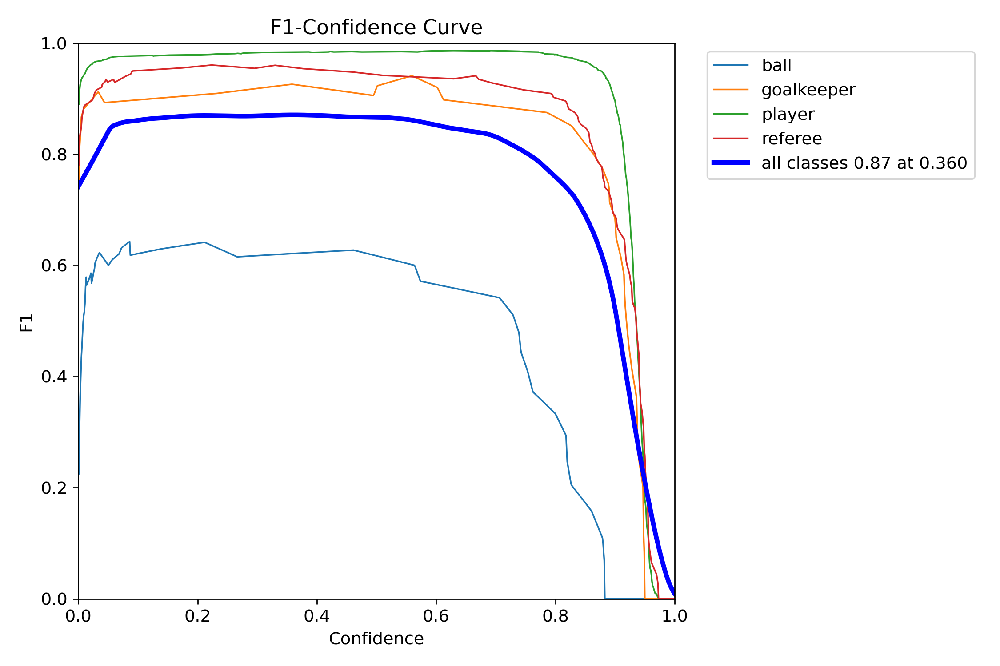
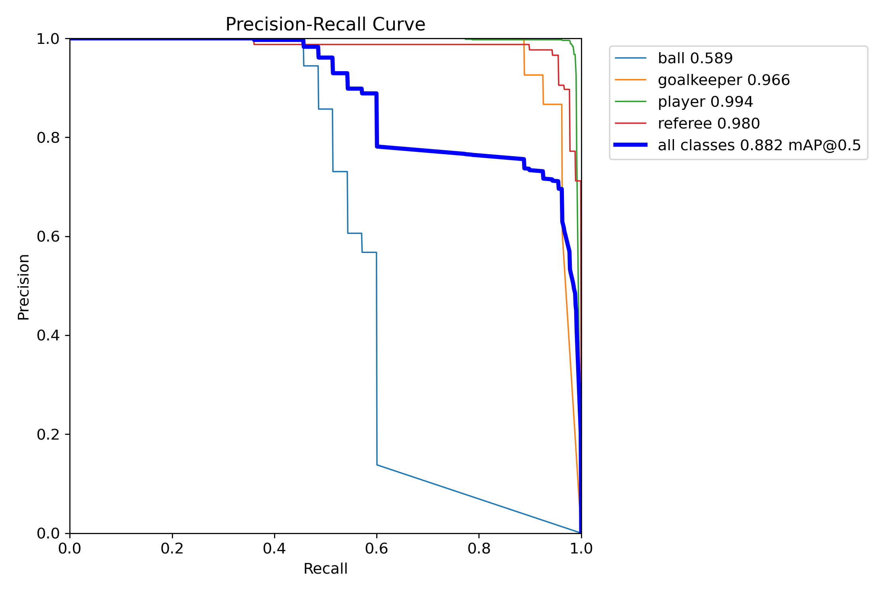
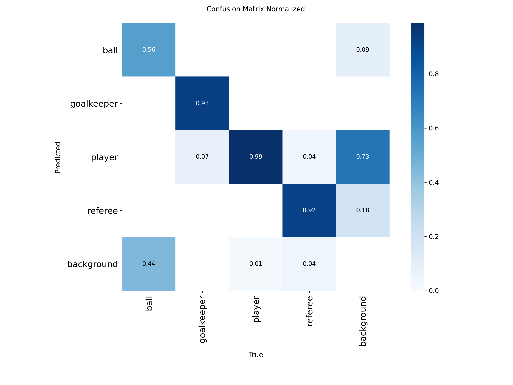
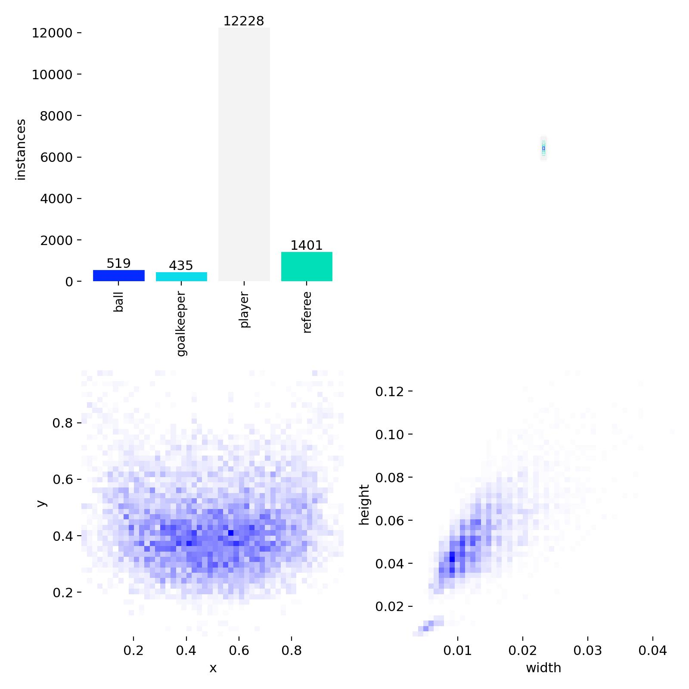
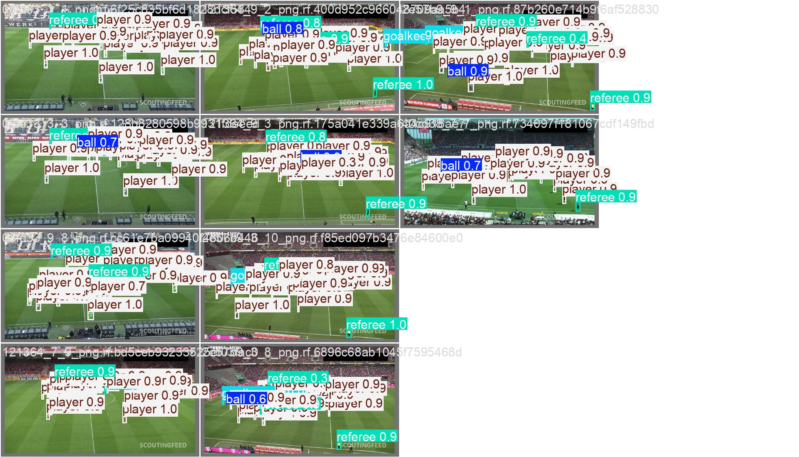

# ⚽ AI-Based Football Analysis System

An end-to-end deep learning pipeline that takes raw football match footage and produces a fully annotated output video — with player tracking, team assignment, ball possession, speed & distance estimation, and camera movement compensation — all accessible through a desktop UI.

---

## Table of Contents

- [⚽ AI-Based Football Analysis System](#-ai-based-football-analysis-system)
  - [Table of Contents](#table-of-contents)
  - [Problem Description](#problem-description)
  - [Proposed Approach \& Implementation Details](#proposed-approach--implementation-details)
  - [Project Structure](#project-structure)
  - [Installation \& Setup](#installation--setup)
  - [How to Run](#how-to-run)
    - [Option A — Desktop UI (Recommended)](#option-a--desktop-ui-recommended)
    - [Option B — Command Line](#option-b--command-line)
    - [Option C — Retrain from scratch (optional)](#option-c--retrain-from-scratch-optional)
  - [UI — Desktop Application](#ui--desktop-application)
    - [How to use](#how-to-use)
  - [Model: Custom YOLO Fine-Tuning](#model-custom-yolo-fine-tuning)
    - [Why Not Pretrained Out of the Box?](#why-not-pretrained-out-of-the-box)
    - [Model Selection \& Architecture](#model-selection--architecture)
    - [Loss Functions](#loss-functions)
    - [Optimization Strategy](#optimization-strategy)
    - [Hyperparameter Choices \& Justification](#hyperparameter-choices--justification)
  - [Experiment Tracking \& Model Selection](#experiment-tracking--model-selection)
  - [Training Curves](#training-curves)
  - [Evaluation Metrics](#evaluation-metrics)
    - [Per-Class Results](#per-class-results)
    - [F1-Confidence Curve](#f1-confidence-curve)
    - [Precision-Recall Curve](#precision-recall-curve)
    - [Confusion Matrix](#confusion-matrix)
  - [Error Analysis](#error-analysis)
  - [Dataset](#dataset)
  - [Inference Pipeline](#inference-pipeline)
  - [Results \& Predictions](#results--predictions)
  - [Insights](#insights)
  - [Resources \& References](#resources--references)

---

## Problem Description

Manually analyzing football match footage is time-consuming and expensive. Coaches, analysts, and broadcasters need automated tools that can:

- Reliably detect and distinguish **players, goalkeepers, referees, and the ball** in broadcast video
- Track individual players across frames despite occlusion, fast motion, and camera movement
- Assign players to their correct teams without manual labeling
- Estimate **real-world speed and distance** covered by each player
- Determine **ball possession** at every moment in the match
- Present all of this in a visual, interactive format

This project solves exactly that — taking a raw match video as input and producing a richly annotated output video, with no manual intervention required beyond hitting Start.

---

## Proposed Approach & Implementation Details

The system is built around a fine-tuned YOLO object detector feeding into a multi-stage analysis pipeline:

1. **Object Detection** — A YOLOv26l model, fine-tuned on a football-specific dataset, detects players, goalkeepers, referees, and the ball at `conf=0.1` to maximize recall for the tracker
2. **Multi-Object Tracking** — ByteTrack maintains consistent track IDs across frames, handling occlusion and re-identification
3. **Camera Movement Compensation** — Lucas-Kanade optical flow on static background regions estimates per-frame camera translation, which is subtracted from all tracked positions
4. **View Transformation** — A homographic projection maps from camera-perspective coordinates to a top-down pitch view, enabling real-world distance calculations
5. **Ball Interpolation** — Missing ball detections (caused by occlusion/motion blur) are filled using linear interpolation + backward fill via pandas
6. **Team Assignment** — KMeans(k=2) clustering on the top-half (jersey) RGB pixels of each player bounding box assigns team identities without any manual labeling
7. **Ball Possession** — The ball is assigned to the nearest player by bounding box proximity each frame; team possession is tracked cumulatively
8. **Speed & Distance** — Player velocities are computed from adjusted, transformed positions in real-world coordinates
9. **Annotation & Rendering** — All data is drawn back onto the original frames: ellipses per player/referee, triangles for ball and possession indicator, semi-transparent overlays for stats

All modules are fully object-oriented, independently importable, and designed to be easily extended or swapped.

---

## Project Structure

```
project/
│
├── app.py                          # Tkinter desktop UI — main entry point
├── main.py                         # CLI entry point
├── requirements.txt                # All dependencies
├── .env                            # Environment config (BASE_DIR)
│
├── analyzer/                       # Core analysis package
│   ├── __init__.py
│   ├── analyzer.py                 # Orchestrates the full pipeline
│   └── modules/
│       ├── tracker/
│       │   ├── __init__.py
│       │   └── tracker.py          # YOLO detection + ByteTrack + annotation drawing
│       ├── team_assigner/
│       │   ├── __init__.py
│       │   └── team_assigner.py    # KMeans jersey color clustering
│       ├── player_ball_assigner/
│       │   ├── __init__.py
│       │   └── player_ball_assigner.py  # Ball possession assignment
│       ├── camera_movement_estimator/
│       │   ├── __init__.py
│       │   └── camera_movement_estimator.py  # Optical flow camera compensation
│       ├── view_transformer/
│       │   ├── __init__.py
│       │   └── view_transformer.py  # Homographic projection to top-down coords
│       └── speed_and_distance_estimator/
│           ├── __init__.py
│           └── speed_and_distance_estimator.py
│
├── utils/
│   ├── __init__.py
│   ├── bbox_utils.py               # Bounding box helper functions
│   └── video_utils.py              # Video read/write utilities
│
├── assets/                         # Training curves, metric plots, sample images
│   ├── results.png
│   ├── confusion_matrix_normalized.png
│   ├── BoxF1_curve.png
│   ├── BoxPR_curve.png
│   ├── labels.jpg
│   ├── val_batch0_pred.jpg
│   └── UI screenshot.png
│
├── train_grid_and_save_best_model.py   # Automated multi-version YOLO grid search
├── download_yolo_models.py             # Downloads all YOLO pretrained weights
├── download_dataset.py                 # Downloads dataset from Roboflow
└── cleanup.py                          # Utility to clean run artifacts
```

**Key design decisions:**
- Each pipeline stage lives in its own module under `analyzer/modules/` — fully isolated and independently testable
- The `Analyzer` class orchestrates the pipeline but doesn't implement any stage itself (single responsibility)
- The `Tracker` class handles both detection/tracking and annotation drawing, keeping rendering logic co-located with tracking state
- Stub caching (`pickle`) is supported at the detection and camera movement stages to skip expensive computation on repeated runs

---

## Installation & Setup

**Requirements:** Python 3.10+

**1. Clone the repo**
```bash
git clone https://github.com/MahmoudSayed216/AI-Based-Football-Analysis.git
cd AI-Based-Football-Analysis
```

**2. Install dependencies**
```bash
pip install -r requirements.txt
```

> **Note on tkinter:** tkinter ships with Python's standard library on most platforms. If it's missing:
> - Ubuntu/Debian: `sudo apt install python3-tk`
> - macOS (Homebrew): `brew install python-tk`
> - Windows: reinstall Python and check "tcl/tk and IDLE" in the installer

**3. Create a `.env` file** in the project root:
```
BASE_DIR=/absolute/path/to/your/project
```

**4. Get the model weights**

Download `best.pt` *(link to be added)* and place it at:
```
$BASE_DIR/best_model/weights/best.pt
```

**5. Place your input video** in:
```
$BASE_DIR/assets/
```

---

## How to Run

### Option A — Desktop UI (Recommended)

```bash
python main.py
```

See the [UI section](#ui--desktop-application) below for full usage instructions.

### Option B — Command Line

```bash
python main.py <video_filename> <batch_size> <read_from_stubs>
```

| Argument | Description | Example |
|---|---|---|
| `video_filename` | Name of video file in `assets/` | `match.mp4` |
| `batch_size` | YOLO inference batch size | `20` |
| `read_from_stubs` | `0` = full inference, `1` = load cached stubs | `0` |

```bash
# First run (generates stubs):
python main.py match.mp4 20 0

# Subsequent runs (fast, skips YOLO inference):
python main.py match.mp4 20 1
```

Output video is saved to `$BASE_DIR/output/output.mp4`.

### Option C — Retrain from scratch (optional)

```bash
# 1. Download all YOLO pretrained weights (v8 through v26)
python download_yolo_models.py

# 2. Download the football dataset from Roboflow
python download_dataset.py

# 3. Run the full training grid — trains all versions/sizes, saves best checkpoint
python train_grid_and_save_best_model.py
```

---

## UI — Desktop Application


The desktop application (`app.py`) provides a dark, minimal interface for running the full pipeline interactively.

### How to use

**Left Panel — Configuration:**

1. **Browse Video** — opens a file picker; select any `.mp4`, `.avi`, or `.mov` input file
2. **Batch size** — frames per YOLO inference batch (default 20; lower this if you run out of GPU/CPU memory)
3. **Read from stubs** — check this on re-runs to skip YOLO inference and load cached results (significantly faster)
4. **Annotation Colours** — click any colored circle to open a color picker and customize the annotation color for: Team 1, Team 2, Referees, Ball, and Ball Possession indicator
5. **▶ START PROCESSING** — runs the full pipeline in a background thread; live progress is shown in the log panel below

**Right Panel — Output Preview:**

The output video loads automatically once processing finishes:
- **▶ / ⏸** — play or pause
- **⏮** — rewind to start
- **Seek slider** — scrub to any position
- **Timestamp** — current position / total duration

---

## Model: Custom YOLO Fine-Tuning

### Why Not Pretrained Out of the Box?

Pretrained YOLO models are trained on COCO — a general-purpose dataset with "person" and "sports ball" but no concept of a goalkeeper, referee, or football pitch context. Using them directly would mean:

- No distinction between players, goalkeepers, and referees (all collapse to "person")
- Poor ball detection under football-specific lighting and occlusion conditions
- No class structure aligned with the downstream tracking and assignment logic

Fine-tuning on a domain-specific dataset gives the model football-specific discrimination while retaining the strong low-level features from COCO pretraining.

### Model Selection & Architecture

Rather than picking a YOLO version arbitrarily, a **full grid search** was run across all major families (excluding `x`-size variants to keep compute tractable):

| Family  | Sizes Trained     |
|---------|-------------------|
| YOLOv8  | n, s, m, l        |
| YOLOv9  | t, s, m, c        |
| YOLOv10 | n, s, m, b        |
| YOLOv11 | n, s, m, l        |
| YOLOv12 | n, s, m, l        |
| YOLOv26 | n, s, m, **l** ✓  |

**Winner: YOLOv26l** — highest mAP@50-95 across all 22 trials.

YOLOv26 introduces a deeper cross-stage partial design with improved gradient flow and a more expressive detection head. The `l` size provided the best accuracy-to-compute tradeoff.

### Loss Functions

**Box regression — CIoU:** Complete IoU accounts for overlap area, center distance, and aspect ratio simultaneously — critical for objects that vary significantly in apparent size and shape across camera angles.

**Classification — Binary Cross-Entropy:** Applied independently per class. With 4 visually distinct classes sharing the same visual context, per-class BCE generalizes better than a joint softmax.

**Distribution Focal Loss (DFL):** Replaces direct coordinate regression with a learned distribution over discretized location bins. Produces sharper box predictions for small, fast-moving objects — directly addressing ball detection difficulty.

### Optimization Strategy

- **Optimizer:** AdamW — weight decay regularizes against overfitting on the relatively small domain dataset
- **LR Schedule:** Cosine annealing (`cos_lr=True`) — avoids step-schedule boundary artifacts, converges to sharper minima
- **Mixed precision:** Disabled (`amp=False`) — observed numerical instability on this dataset with FP16
- **Multi-GPU:** 2× T4 (`device=[0,1]`) with data parallelism
- **Batch:** 10 (train), 16 (val)

### Hyperparameter Choices & Justification

| Hyperparameter     | Value | Justification |
|--------------------|-------|---------------|
| `epochs`           | 100   | Loss plateaus well before 100; best checkpoint is selected automatically |
| `imgsz`            | 640   | Standard YOLO resolution; ball detection benefits from full 640px detail |
| `batch`            | 10    | T4 VRAM limit with YOLOv26l |
| `cos_lr`           | True  | Smoother convergence than step-based LR decay |
| `amp`              | False | Disabled due to FP16 instability on this dataset |
| `conf` (inference) | 0.1   | Maximizes recall; ByteTrack suppresses false positives via track consistency |
| `save_period`      | -1    | Only final checkpoint saved per trial to reduce I/O across 22 runs |

---

## Experiment Tracking & Model Selection

The grid search logic in `train_grid_and_save_best_model.py`:

```python
current_best_map = -∞
for model_version in [v8, v9, v10, v11, v12, v26]:
    for model_size in [n, s, m, l]:
        train(model, epochs=100)
        val_map = validate(model).box.map    # mAP@50-95
        if val_map > current_best_map:
            current_best_map = val_map
            overwrite best_model/
        cleanup run directory
```

Each model is trained from its COCO pretrained checkpoint, fine-tuned for 100 epochs, then validated on the held-out set. The best checkpoint is atomically moved to `best_model/` and all intermediate artifacts are cleaned up.

**Result: YOLOv26l won** with overall mAP@50-95 = **0.641**.

---

## Training Curves



Observations from the winning YOLOv26l run across 100 epochs:

- **Box loss** (train + val) decreases smoothly throughout — no plateau or divergence
- **Classification loss** drops sharply in the first ~15 epochs (pretrained features), then continues to slowly improve — typical fine-tuning pattern
- **DFL loss** converges to ~0.0006 train, indicating confident box boundary predictions
- **Precision** stabilizes above 0.95 around epoch 30
- **Recall** climbs steadily to ~0.83 — the remaining gap is almost entirely ball detection misses
- **mAP@50** plateaus at 0.88, **mAP@50-95** at 0.64

---

## Evaluation Metrics

### Per-Class Results

| Class      | Images | Instances | Precision | Recall | mAP@50 | mAP@50-95 |
|------------|--------|-----------|-----------|--------|--------|-----------|
| **all**    | 38     | 905       | 0.964     | 0.826  | 0.882  | 0.641     |
| ball       | 35     | 35        | 0.970     | 0.457  | 0.589  | 0.284     |
| goalkeeper | 27     | 27        | 0.926     | 0.925  | 0.966  | 0.760     |
| player     | 38     | 754       | 0.984     | 0.984  | 0.994  | 0.818     |
| referee    | 38     | 89        | 0.977     | 0.936  | 0.980  | 0.702     |

Inference speed: **21ms/image** on T4 ×2 | **~250ms/image** on Intel Core i7-1355U

### F1-Confidence Curve



Optimal operating point: confidence **0.36**, F1 = **0.87** across all classes. Player and referee F1 stays above 0.9 across a wide confidence range; ball drops off earlier due to its inherently lower recall ceiling.

### Precision-Recall Curve



- **Player** — near-perfect curve, mAP@50 = 0.994
- **Referee** — mAP@50 = 0.980
- **Goalkeeper** — mAP@50 = 0.966, slight player confusion at some angles
- **Ball** — mAP@50 = 0.589, degrades rapidly at higher recall thresholds

### Confusion Matrix



Key failure modes:

- **Ball → background (0.44):** Nearly half of ball instances missed — tiny, fast, frequently occluded
- **Background → player (0.73):** Crowd/ad boards near pitch edges cause false positives; suppressed by ByteTrack
- **Goalkeeper → player (0.07):** Handled explicitly in the tracker by remapping goalkeeper to the player class
- **Referee → background (0.18):** Small miss rate

---

## Error Analysis

**Ball detection is the primary failure mode.** Recall of 0.457 means roughly half of ball instances are missed. Root causes:

1. **Scale** — at 640×640 input, the ball occupies only ~8–20px diameter
2. **Motion blur** — fast movement degrades edge and color signal
3. **Occlusion** — the ball near player feet is frequently obscured
4. **Class imbalance** — 519 ball instances vs. 12,228 player instances in training data

**Mitigations applied in the pipeline:**
- `pandas.DataFrame.interpolate()` + `.bfill()` fills missing ball detections with smooth linear estimates
- ByteTrack's track consistency filters single-frame false positives across all classes
- Low inference confidence (`0.1`) maximizes recall before the tracker applies temporal filtering

---

## Dataset

Football player detection dataset sourced from Roboflow — downloaded via `download_dataset.py`.

**[Dataset on Roboflow Universe](https://universe.roboflow.com/roboflow-jvuqo/football-players-detection-3zvbc)**



Strong class imbalance: 12,228 player instances vs. 519 ball, 435 goalkeeper, and 1,401 referee instances. Bounding boxes cluster in the center-lower portion of frames, with normalized widths tightly distributed around 0.01–0.03 — confirming the small-object challenge.

---

## Inference Pipeline

```
1.  read_video_as_frames()                Decode video → list of RGB frames
2.  tracker.get_object_tracks()           YOLO detect → ByteTrack → per-frame track dicts
3.  tracker.add_position_to_tracks()      Foot/center position per entity per frame
4.  camera_movement_estimator             Lucas-Kanade optical flow on background strips
5.  add_adjust_positions_to_tracks()      Subtract camera motion from all positions
6.  view_transformer                      Homographic projection → top-down pitch coords
7.  tracker.interpolate_ball_positions()  Linear interp + bfill on missing ball detections
8.  speed_and_distance_estimator          Velocity and cumulative distance per player
9.  team_assigner                         KMeans(k=2) on top-half jersey RGB → team IDs
10. player_ball_assigner                  Nearest player by bbox proximity → possession
11. tracker.draw_annotations()            Ellipses, triangles, possession + stats overlays
12. camera_movement_estimator.draw()      Camera delta overlay per frame
13. speed_and_distance_estimator.draw()   Speed/distance stats overlay per player
14. write_frames_as_video()               Encode annotated frames → output.mp4
```

Stub caching is available at steps 2 and 4 — pass `read_from_stubs=True` to skip inference on re-runs.

---

## Results & Predictions

Sample validation predictions from YOLOv26l:



The model detects players at 0.9–1.0 confidence across varied pitch conditions, camera angles, and lighting. Ball detections appear at 0.6–0.9 confidence when clearly visible.

---

## Insights

**YOLOv26l vs. earlier versions:** The jump from v11/v12 to v26 was meaningful. The improved detection head benefits small-object tasks disproportionately — which matters most for ball detection.

**Cosine LR:** Switching to `cos_lr=True` produced smoother convergence and marginally better final mAP vs. step-based decay. The classification loss curve avoids the sudden jumps typical of step schedules.

**KMeans top-half cropping:** Using only the jersey region (top half of bbox) for color clustering is deliberate. Shorts colors are often similar across teams and referees; the jersey is the most discriminative visual feature for team separation.

**Ball interpolation:** `pandas.interpolate()` + `bfill()` is simple but highly effective. Linear interpolation works well for the ball's near-continuous motion, and `bfill` handles the start-of-clip edge case.

**Camera movement compensation:** Without optical flow compensation, player speed estimates would be corrupted by camera pan/tilt. The compensation step separates true player motion from apparent motion caused by the camera.

**Low confidence threshold:** Running at `conf=0.1` is intentional — ByteTrack's track consistency filtering handles false positives far better than missing true positives at a higher threshold. The tracker acts as a temporal confidence gate.

---

## Resources & References

**Dataset**
- [Football Player Detection Dataset — Roboflow Universe](https://universe.roboflow.com/roboflow-jvuqo/football-players-detection-3zvbc)

**Pretrained Model Weights**
- [Ultralytics Assets — GitHub Releases](https://github.com/ultralytics/assets/releases)

**Libraries & Frameworks**
- [Ultralytics YOLO](https://github.com/ultralytics/ultralytics)
- [Supervision / ByteTrack](https://github.com/roboflow/supervision)
- [OpenCV](https://opencv.org/)
- [scikit-learn (KMeans)](https://scikit-learn.org/)
- [pandas](https://pandas.pydata.org/)

**Research Papers**
- [ByteTrack: Multi-Object Tracking by Associating Every Detection Box](https://arxiv.org/abs/2110.06864)
- [Generalized Focal Loss V2 (Distribution Focal Loss)](https://arxiv.org/abs/2011.12885)
- [Lucas-Kanade Optical Flow Method](https://en.wikipedia.org/wiki/Lucas%E2%80%93Kanade_method)

**Reference Implementation**
- [abdullahtarek/football_analysis](https://github.com/abdullahtarek/football_analysis)